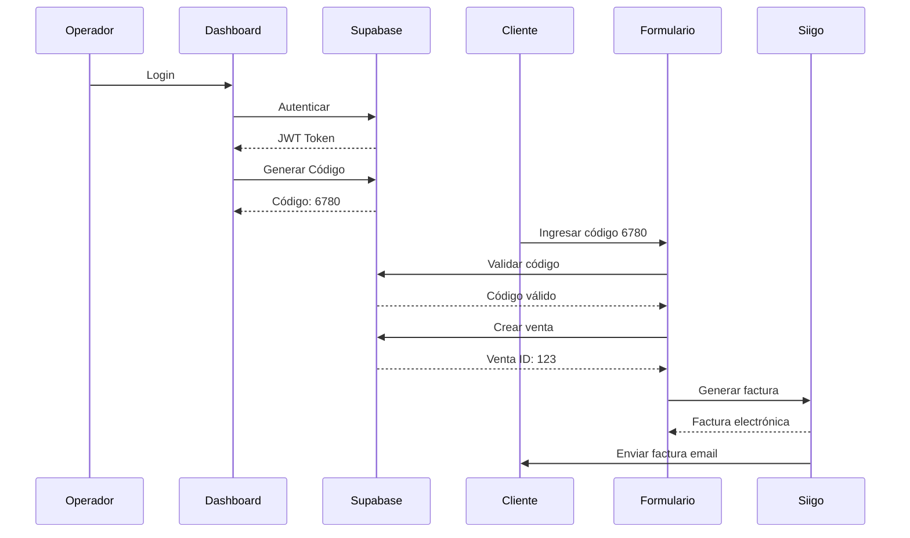

# 🛴 Flotu Mobility - Sistema de Facturación Electrónica

<div align="center">


**Sistema integral de facturación electrónica y gestión de ventas para servicios de movilidad eléctrica**

Desarrollado por **Pivvot Consulting** - Área de I+D  
Cliente: **Flotu Mobility**

[Características](#-características-principales) •
[Instalación](#-instalación-y-configuración) •
[Arquitectura](#-arquitectura-del-sistema) •
[Documentación](#-documentación-técnica)

</div>

---

## 📋 Tabla de Contenidos

- [Descripción General](#-descripción-general)
- [Características Principales](#-características-principales)
- [Stack Tecnológico](#-stack-tecnológico)
- [Arquitectura del Sistema](#-arquitectura-del-sistema)
- [Instalación y Configuración](#-instalación-y-configuración)
- [Flujos de Usuario](#-flujos-de-usuario)
- [Estructura del Proyecto](#-estructura-del-proyecto)
- [Seguridad](#-seguridad-y-cumplimiento)
- [Despliegue](#-despliegue)
- [Documentación Técnica](#-documentación-técnica)
- [Solución de Problemas](#-solución-de-problemas)
- [Equipo de Desarrollo](#-equipo-de-desarrollo)

---

## 🎯 Descripción General

Sistema empresarial de facturación electrónica diseñado específicamente para **Flotu Mobility**, empresa líder en servicios de movilidad sostenible mediante scooters eléctricos. El sistema automatiza completamente el proceso de facturación, desde la generación de códigos de venta hasta la emisión de facturas electrónicas validadas por la DIAN.

### Problemática Resuelta

- ✅ **Facturación manual** → Facturación automática en tiempo real
- ✅ **Desconexión operador-cliente** → Sistema de códigos temporales vinculados
- ✅ **Registro de aceptaciones legales** → Cumplimiento normativo automático
- ✅ **Sin trazabilidad** → Dashboard con estadísticas en tiempo real
- ✅ **Procesos dispersos** → Integración dual Supabase + Siigo

### Impacto Empresarial

- 🚀 **90% reducción** en tiempo de facturación
- 📊 **100% trazabilidad** de ventas y operadores
- ⚡ **Tiempo real** en generación de documentos electrónicos
- 🔐 **Cumplimiento DIAN** automático
- 📱 **Experiencia móvil** optimizada para operadores en campo

---

## ⚡ Características Principales

### 🔐 Gestión de Operadores

- **Autenticación segura** con Supabase Auth (JWT)
- **Dashboard personalizado** con métricas de rendimiento
- **Generación de códigos temporales** (4 dígitos, 30 min validez)
- **Seguimiento en tiempo real** de códigos activos
- **Regeneración automática** tras uso de código
- **Estadísticas de ventas** (total, promedio, tendencias)

### 👥 Portal de Clientes

- **Formulario público** optimizado para móviles
- **Validación de códigos** en tiempo real
- **Múltiples métodos de pago** (Efectivo, Wompi)
- **Registro de aceptaciones legales** con trazabilidad completa
- **Cálculo automático** de servicios y tiempos
- **Interfaz intuitiva** con validación en tiempo real

### 📄 Facturación Electrónica

- **Integración directa con Siigo** (API v1)
- **Factura electrónica DIAN** con firma digital
- **Envío automático** al cliente vía email
- **Múltiples productos** configurables
- **IVA calculado** automáticamente
- **Trazabilidad completa** de documentos electrónicos

### 🔄 Sistema de Códigos Temporales

- **Generación automática** de códigos únicos
- **Expiración configurable** (30 minutos default)
- **Validación en dos pasos** (existencia + vigencia)
- **Prevención de duplicados** con constraints únicos
- **Marcado automático** como usado tras venta
- **Regeneración inteligente** sin intervención manual

---

## 🛠️ Stack Tecnológico

### Frontend

| Tecnología | Versión | Uso |
|------------|---------|-----|
| **Next.js** | 14.2.14 | Framework React con App Router y SSR |
| **React** | 18 | Librería UI con componentes funcionales |
| **TypeScript** | 5.0 | Tipado estático y seguridad en compilación |
| **NextUI** | 2.2 | Sistema de componentes UI moderno |
| **TailwindCSS** | 3.4 | Framework CSS utility-first |
| **Framer Motion** | 11.11 | Animaciones y transiciones fluidas |
| **React Hook Form** | - | Gestión de formularios optimizada |
| **React Hot Toast** | 2.6 | Notificaciones de usuario |
| **Lucide React** | 0.546 | Iconos SVG optimizados |

### Backend & Base de Datos

| Tecnología | Versión | Uso |
|------------|---------|-----|
| **Supabase** | 2.76 | Backend as a Service (BaaS) |
| **PostgreSQL** | 15 | Base de datos relacional |
| **Supabase Auth** | 0.10 | Autenticación y sesiones |
| **Row Level Security** | - | Políticas de seguridad a nivel de fila |
| **Realtime** | - | Subscripciones en tiempo real |

### Integraciones

| Servicio | Versión | Uso |
|----------|---------|-----|
| **Siigo API** | v1 | Facturación electrónica DIAN |
| **Wompi** | - | Pasarela de pagos online |
| **Axios** | 1.7 | Cliente HTTP para APIs externas |

### DevOps & Deployment

| Herramienta | Versión | Uso |
|-------------|---------|-----|
| **Docker** | Latest | Containerización de aplicación |
| **Docker Compose** | - | Orquestación multi-contenedor |
| **Nginx** | Alpine | Reverse proxy y SSL |
| **Node.js** | 20.13.1 | Runtime de JavaScript |

## 🚀 Inicio Rápido

### 1. Clonar e Instalar

```bash
# Instalar dependencias
npm install
```

---

## 🏗️ Arquitectura del Sistema

### Patrón de Diseño: Arquitectura por Capas

```
┌─────────────────────────────────────────────────────────────┐
│                        PRESENTACIÓN                          │
│  ┌──────────────┐  ┌──────────────┐  ┌──────────────┐      │
│  │   Operator   │  │    Client    │  │     API      │      │
│  │   Dashboard  │  │     Form     │  │   Routes     │      │
│  └──────────────┘  └──────────────┘  └──────────────┘      │
└─────────────────────────────────────────────────────────────┘
                          ↓↑
┌─────────────────────────────────────────────────────────────┐
│                      CONTROLADORES                           │
│  ┌──────────────┐  ┌──────────────┐  ┌──────────────┐      │
│  │     Auth     │  │   Operator   │  │     Sale     │      │
│  │  Controller  │  │  Controller  │  │  Controller  │      │
│  └──────────────┘  └──────────────┘  └──────────────┘      │
└─────────────────────────────────────────────────────────────┘
                          ↓↑
┌─────────────────────────────────────────────────────────────┐
│                        SERVICIOS                             │
│  ┌──────────────┐  ┌──────────────┐  ┌──────────────┐      │
│  │   Supabase   │  │     Siigo    │  │    Wompi     │      │
│  │   Service    │  │   Service    │  │   Service    │      │
│  └──────────────┘  └──────────────┘  └──────────────┘      │
└─────────────────────────────────────────────────────────────┘
                          ↓↑
┌─────────────────────────────────────────────────────────────┐
│                    CAPA DE DATOS                             │
│  ┌──────────────┐  ┌──────────────┐  ┌──────────────┐      │
│  │  PostgreSQL  │  │   Siigo API  │  │   Wompi API  │      │
│  │  (Supabase)  │  │    (DIAN)    │  │    (Pagos)   │      │
│  └──────────────┘  └──────────────┘  └──────────────┘      │
└─────────────────────────────────────────────────────────────┘
```

### Flujo de Datos Principal



### Modelo de Base de Datos

```sql
-- Tabla principal de operadores
operadores (
  id UUID PRIMARY KEY,
  email TEXT UNIQUE,
  nombre TEXT,
  created_at TIMESTAMP
)

-- Códigos temporales de venta
operator_codes (
  id SERIAL PRIMARY KEY,
  operator_id UUID → operadores.id,
  code TEXT UNIQUE,
  expires_at TIMESTAMP,
  used_at TIMESTAMP NULL,
  venta_id INT → ventas.id
)

-- Información de clientes
clientes (
  id SERIAL PRIMARY KEY,
  tipo_documento ENUM('CC', 'Pasaporte', 'NIT'),
  numero_documento TEXT,
  nombre TEXT,
  apellido TEXT,
  correo TEXT,
  direccion TEXT,
  celular TEXT
)

-- Registro de ventas
ventas (
  id SERIAL PRIMARY KEY,
  operador_id UUID → operadores.id,
  cliente_id INT → clientes.id,
  tiempo_servicio_min INT,
  valor_total NUMERIC,
  created_at TIMESTAMP
)

-- Aceptaciones legales (compliance)
aceptaciones (
  id SERIAL PRIMARY KEY,
  venta_id INT → ventas.id,
  acepta_terminos BOOLEAN,
  acepta_privacidad BOOLEAN,
  version_terminos TEXT,
  version_privacidad TEXT,
  ip TEXT,
  user_agent TEXT
)
```

---

## 💻 Instalación y Configuración

### Requisitos Previos

- **Node.js** 20.x (versión LTS recomendada)
- **npm** 10.x o superior como gestor de paquetes
- **Cuenta de Supabase** (gratuita disponible)
- **Cuenta de Siigo** con acceso a API
- **Git** para control de versiones

### 1. Clonar el Repositorio

```bash
git clone https://github.com/Pivvot-Consulting/billing-form.git
cd billing-form
```

### 2. Instalar Dependencias

```bash
npm install
```

### 3. Configurar Supabase (⚠️ CRÍTICO)

#### 3.1. Crear Proyecto en Supabase

1. Acceder a [https://supabase.com/dashboard](https://supabase.com/dashboard)
2. Crear nuevo proyecto
3. Copiar `URL` y `anon key` del proyecto

#### 3.2. Ejecutar Scripts SQL (EN ORDEN)

**⚠️ IMPORTANTE: Ejecutar en Supabase SQL Editor**

```sql
-- 1. 🔴 OBLIGATORIO - Políticas RLS para validación de códigos
-- Archivo: scripts/supabase_rls_operator_codes.sql
-- Sin esto, el formulario público NO puede validar códigos

-- 2. 🟠 OBLIGATORIO - Fix ENUM tipo_documento
-- Archivo: scripts/supabase_fix_enum_tipo_documento.sql
-- Agrega valores PP (Pasaporte) y NIT al ENUM

-- 3. 🟡 RECOMENDADO - Función crear_envio_completo
-- Archivo: scripts/supabase_crear_envio_completo.sql
-- Optimiza creación de ventas en transacción única

-- 4. 🟢 OPCIONAL - Función generar_codigo_operador
-- Archivo: scripts/supabase_generar_codigo_operador.sql
-- Mejora rendimiento de generación de códigos
```

### 4. Configurar Variables de Entorno

Crear archivo `.env.local` en la raíz del proyecto:

```bash
# ===============================================
# SUPABASE - BACKEND (OBLIGATORIO)
# ===============================================
NEXT_PUBLIC_SUPABASE_URL=https://tu-proyecto.supabase.co
NEXT_PUBLIC_SUPABASE_ANON_KEY=tu_anon_key_aqui

# ===============================================
# SIIGO - FACTURACIÓN ELECTRÓNICA (OBLIGATORIO)
# ===============================================
SIIGO_USER_NAME=usuario@flotu.com
SIIGO_ACCESS_KEY=tu_access_key_de_siigo

# IDs de configuración Siigo (Flotu Mobility)
SIIGO_DOCUMENT_ID=28010          # ID documento factura
SIIGO_COST_CENTER_ID=849         # Centro de costos
SIIGO_SELLER_ID=488              # ID vendedor
SIIGO_PAYMENT_ID=4366            # Método de pago

# ===============================================
# WOMPI - PASARELA DE PAGOS (OPCIONAL)
# ===============================================
NEXT_PUBLIC_WOMPI_PAYMENT_URL=https://checkout.wompi.co/p/...

# ===============================================
# GENERAL
# ===============================================
NODE_ENV=development
NEXT_TELEMETRY_DISABLED=1
```

### 5. Ejecutar en Desarrollo

```bash
npm run dev
```

La aplicación estará disponible en:
- 🌐 **URL Local**: [http://localhost:3000](http://localhost:3000)
- 👤 **Login Operador**: `/operator/login`
- 📝 **Formulario Cliente**: `/cliente/efectivo`

### 6. Build para Producción

```bash
# Generar build optimizado
npm run build

# Ejecutar en producción
npm start
```

---

## 👥 Flujos de Usuario

### 🔵 Flujo de Operador

```
1. Login con credenciales
   ↓
2. Dashboard con código activo
   ↓
3. Generar nuevo código (si es necesario)
   ↓
4. Compartir código con cliente
   ↓
5. Monitorear uso del código en tiempo real
   ↓
6. Ver estadísticas de ventas
```

**Rutas del Operador:**
- `/operator/login` - Autenticación
- `/operator/dashboard` - Panel principal

### 🟢 Flujo de Cliente

```
1. Acceder al formulario público
   ↓
2. Aceptar términos y condiciones
   ↓
3. Seleccionar método de pago
   ↓
4. Ingresar código del operador
   ↓
5. Completar datos personales
   ↓
6. Configurar tiempo de servicio
   ↓
7. Confirmar y registrar venta
   ↓
8. Recibir factura electrónica por email
```

**Rutas del Cliente:**
- `/` - Selección de método de pago
- `/cliente/efectivo` - Formulario para pago en efectivo
- `/cliente/virtual` - Formulario para pago con Wompi

---

## 📁 Estructura del Proyecto

```
billing-form/
├── src/
│   ├── app/                          # Next.js App Router
│   │   ├── page.tsx                  # Página principal (selección rol)
│   │   ├── operator/                 # Módulo de Operadores (Privado)
│   │   │   ├── login/                # Autenticación
│   │   │   └── dashboard/            # Dashboard principal
│   │   └── cliente/                  # Módulo de Clientes (Público)
│   │       ├── metodo-pago/          # Selección método pago
│   │       └── efectivo/             # Formulario de venta
│   │
│   ├── controllers/                  # Capa de Controladores
│   │   ├── auth.controller.ts        # Lógica de autenticación
│   │   ├── operator.controller.ts    # Gestión de operadores
│   │   └── sale.controller.ts        # Procesamiento de ventas
│   │
│   ├── services/                     # Capa de Servicios
│   │   ├── supabase/                 # Servicios Supabase
│   │   │   ├── auth.service.ts       # Autenticación
│   │   │   ├── operator.service.ts   # Códigos y operadores
│   │   │   └── sales.service.ts      # Gestión de ventas
│   │   └── SiigoService.ts           # Integración Siigo API
│   │
│   ├── hooks/                        # Custom React Hooks
│   │   ├── useAuth.ts                # Hook de autenticación
│   │   ├── useOperatorCode.ts        # Gestión de códigos
│   │   ├── useOperatorCodeRealtime.ts # Subscripciones realtime
│   │   └── useSales.ts               # Operaciones de venta
│   │
│   ├── types/                        # TypeScript Definitions
│   │   ├── dto/                      # Data Transfer Objects
│   │   │   ├── auth.dto.ts
│   │   │   └── sale.dto.ts
│   │   ├── entities/                 # Entidades de dominio
│   │   │   ├── client.types.ts
│   │   │   ├── operator.types.ts
│   │   │   ├── operatorCode.types.ts
│   │   │   └── sale.types.ts
│   │   └── enums/                    # Enumeraciones
│   │       └── index.ts
│   │
│   ├── constants/                    # Constantes globales
│   │   ├── form.constants.ts         # Validaciones y opciones
│   │   ├── routes.ts                 # Rutas de navegación
│   │   └── supabase.constants.ts     # Configuración Supabase
│   │
│   ├── components/                   # Componentes UI reutilizables
│   │   ├── common/                   # Componentes comunes
│   │   └── ErrorBoundary.tsx         # Manejo de errores
│   │
│   ├── lib/                          # Configuración de librerías
│   │   └── supabase.ts               # Cliente Supabase
│   │
│   ├── utils/                        # Utilidades
│   │   └── errorHandler.ts           # Manejo centralizado de errores
│   │
│   └── middleware.ts                 # Middleware de Next.js (Auth)
│
├── scripts/                          # Scripts SQL y utilidades
│   ├── supabase_rls_operator_codes.sql        # ⚠️ OBLIGATORIO
│   ├── supabase_fix_enum_tipo_documento.sql   # ⚠️ OBLIGATORIO
│   ├── supabase_crear_envio_completo.sql      # Recomendado
│   ├── supabase_generar_codigo_operador.sql   # Opcional
│   └── get-siigo-products.js                  # Utilidad Siigo
│
├── public/                           # Archivos estáticos
├── .env.local                        # Variables de entorno (no versionado)
├── .env.example                      # Template de variables
├── Dockerfile                        # Configuración Docker
├── docker-compose.yml                # Desarrollo con Docker
├── docker-compose.prod.yml           # Producción con Docker
├── nginx.conf                        # Configuración Nginx
└── package.json                      # Dependencias del proyecto
```

---

## 🔐 Seguridad y Cumplimiento

### Autenticación y Autorización

- **JWT Tokens** con Supabase Auth
- **Row Level Security (RLS)** en todas las tablas
- **Políticas de acceso** granulares por rol
- **Sesiones seguras** con refresh tokens automáticos
- **Middleware de protección** en rutas privadas

### Protección de Datos

```sql
-- Ejemplo de Política RLS
CREATE POLICY "Operadores solo ven sus ventas"
ON ventas FOR SELECT
TO authenticated
USING (operador_id = auth.uid());
```

### Cumplimiento Normativo

- ✅ **GDPR**: Registro de consentimientos con trazabilidad
- ✅ **DIAN**: Facturación electrónica validada
- ✅ **Protección de datos**: Encriptación en tránsito y reposo
- ✅ **Auditoría**: Logs completos de todas las operaciones
- ✅ **Términos y condiciones**: Versioning y tracking de aceptaciones

### Validaciones de Seguridad

- Sanitización de inputs en frontend y backend
- Validación de códigos con doble verificación (existencia + vigencia)
- Rate limiting en endpoints críticos
- CORS configurado específicamente para dominios permitidos
- Variables de entorno nunca expuestas al cliente

---

## 🚀 Despliegue

### Opción 1: Docker (Recomendado)

```bash
# Desarrollo
docker-compose up -d

# Producción
docker-compose -f docker-compose.prod.yml up -d
```

**Características del deployment Docker:**
- ✅ Build optimizado multi-stage
- ✅ Nginx como reverse proxy
- ✅ SSL/TLS configurado
- ✅ Health checks automáticos
- ✅ Resource limits (512MB RAM)
- ✅ Restart automático en fallos

### Opción 2: Vercel (Next.js Nativo)

```bash
# Instalar Vercel CLI
npm i -g vercel

# Deploy
vercel --prod
```

**Configuración en Vercel:**
1. Conectar repositorio de GitHub
2. Configurar variables de entorno (`.env.local`)
3. Deploy automático en cada push a `main`

### Opción 3: VM/VPS Manual

```bash
# 1. Clonar repositorio
git clone https://github.com/Pivvot-Consulting/billing-form.git

# 2. Instalar dependencias
npm install

# 3. Build
npm run build

# 4. Ejecutar con PM2
pm2 start npm --name "billing-form" -- start
pm2 save
pm2 startup
```

### Variables de Entorno en Producción

Asegurarse de configurar en el servidor:

```bash
NODE_ENV=production
NEXT_TELEMETRY_DISABLED=1
NEXT_PUBLIC_SUPABASE_URL=https://...
NEXT_PUBLIC_SUPABASE_ANON_KEY=...
SIIGO_USER_NAME=...
SIIGO_ACCESS_KEY=...
# ... resto de variables
```

---

## 📚 Documentación Técnica

### Documentos Disponibles

- **Scripts SQL**: Configuración completa de Supabase
  - `scripts/supabase_rls_operator_codes.sql` - Políticas RLS
  - `scripts/supabase_fix_enum_tipo_documento.sql` - Fix ENUM
  - `scripts/supabase_crear_envio_completo.sql` - Función RPC ventas
  - `scripts/supabase_generar_codigo_operador.sql` - Función RPC códigos

### API Endpoints

#### Supabase RPC Functions

```typescript
// Crear venta completa (transacción atómica)
POST /rest/v1/rpc/crear_envio_completo
Body: {
  p_operator_code: string,
  p_tipo_documento: 'CC' | 'Pasaporte' | 'NIT',
  p_numero_documento: string,
  p_nombre: string,
  p_apellido: string,
  p_correo: string,
  p_direccion: string,
  p_celular: string,
  p_tiempo_servicio_min: number,
  p_valor_total: number,
  p_acepta_terminos: boolean,
  p_acepta_privacidad: boolean,
  p_version_terminos: string,
  p_version_privacidad: string
}

// Generar código de operador
POST /rest/v1/rpc/generar_codigo_operador
Body: {
  p_len: number,      // Longitud del código (default: 4)
  p_expira_min: number // Minutos hasta expiración (default: 30)
}
```

#### Tablas Supabase

```typescript
// Obtener ventas del operador autenticado
GET /rest/v1/ventas?select=*,clientes(*)&order=created_at.desc

// Obtener código activo del operador
GET /rest/v1/operator_codes?select=*&is.used_at=null&gt.expires_at=now()

// Obtener estadísticas
GET /rest/v1/ventas?select=valor_total.sum()
```

---

## 🐛 Solución de Problemas

### Error: "No se encontró código activo con ese valor"

**Síntoma:** El formulario no valida códigos correctamente

**Causa:** Faltan políticas RLS para usuarios anónimos

**Solución:**
```bash
# Ejecutar en Supabase SQL Editor
scripts/supabase_rls_operator_codes.sql
```

---

### Error: ENUM tipo_documento inválido

**Síntoma:** `invalid input value for enum tipo_documento: "PP"`

**Causa:** El ENUM no incluye todos los tipos de documento

**Solución:**
```bash
# Ejecutar en Supabase SQL Editor
scripts/supabase_fix_enum_tipo_documento.sql
```

---

### Error: Constraint único violado

**Síntoma:** `duplicate key value violates unique constraint`

**Causa:** Códigos expirados no se desactivan correctamente

**Solución:** Ya corregido en el código. Opcional ejecutar:
```bash
scripts/supabase_generar_codigo_operador.sql
```

---

### Error: Factura no se genera en Siigo

**Verificar:**
1. Credenciales de Siigo en `.env.local`
2. IDs de configuración correctos (documento, seller, payment)
3. Logs en consola del servidor

**Solución común:**
```bash
# Verificar variables de entorno
echo $SIIGO_USER_NAME
echo $SIIGO_ACCESS_KEY
```

---

## 👨‍💻 Equipo de Desarrollo

### Pivvot Consulting - Área de I+D

**Desarrollado por:**
- Área de Investigación y Desarrollo
- Pivvot Consulting S.A.S.

**Cliente:**
- Flotu Mobility

**Tecnologías Core:**
- Next.js 14
- TypeScript 5
- Supabase
- Siigo API

**Año:** 2024-2025

**Contacto Técnico:**
- 📧 Email: [email protected]
- 🌐 Web: pivvotconsulting.com

---

## 📄 Licencia y Propiedad Intelectual

```
Copyright © 2024-2025 Pivvot Consulting S.A.S.
Todos los derechos reservados.

Este software es propiedad exclusiva de Pivvot Consulting S.A.S.
y ha sido desarrollado específicamente para Flotu Mobility.

Prohibida su reproducción, distribución o modificación sin 
autorización expresa por escrito del propietario.
```

---

## 📞 Soporte y Mantenimiento

Para soporte técnico, reportar bugs o solicitar nuevas funcionalidades:

1. **Issues en GitHub**: [Repositorio Privado]
2. **Email**: soporte@pivvotconsulting.com
3. **Documentación**: Ver carpeta `/docs` (si aplica)

---

<div align="center">

**🛴 Desarrollado con ❤️ por Pivvot Consulting**

*Transformando la movilidad eléctrica con tecnología de punta*

[Pivvot Consulting](https://pivvotconsulting.com) | [Flotu Mobility](https://flotumobility.com)

</div>
